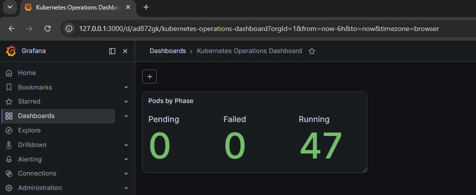
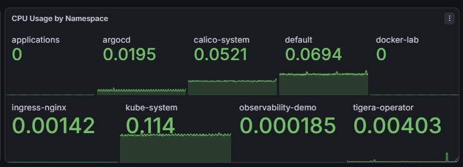
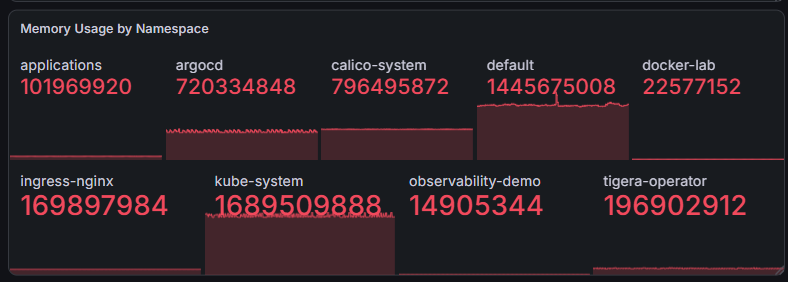
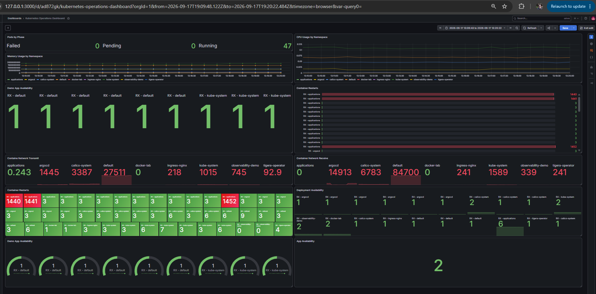

# 03 - Operational Dashboard

## Objective

Build a Grafana dashboard that provides an operational view of the Kubernetes
cluster and the demo application.

## Dashboard

The dashboard is named `Kubernetes Operations Dashboard` and uses the
Prometheus data source.

## Completed Panels

### Pods by Phase

PromQL query:

```promql
sum by (phase) (
	kube_pod_status_phase{
		phase=~"Running|Pending|Failed"
	}
)
```

The panel shows the current count of pods in the `Running`, `Pending`, and
`Failed` phases. The panel was saved in Grafana before the evidence screenshot
was captured.

Evidence:

- File: `screenshots/grafana/04-grafana-pods-by-phase.png`
- Evidence ID: `E04`



### CPU Usage by Namespace

PromQL query:

```promql
sum by (namespace) (
	rate(container_cpu_usage_seconds_total{
		container!="",
		container!="POD",
		namespace!=""
	}[5m])
)
```

This panel displays CPU consumption per namespace over the selected time range.
The panel was saved and the evidence screenshot was captured.

Evidence:

- File: `screenshots/grafana/05-grafana-cpu-usage-by-namespace.png`
- Evidence ID: `E05`



### Memory Usage by Namespace

PromQL query:

```promql
sum by (namespace) (
	container_memory_working_set_bytes{
		container!="",
		container!="POD",
		namespace!=""
	}
)
```

This panel shows memory usage per namespace and helps compare resource
consumption across Kubernetes workloads.

Evidence:

- File: `screenshots/grafana/06-grafana-memory-usage-by-namespace.png`
- Evidence ID: `E06`



### Network Traffic

The dashboard contains separate receive and transmit panels. Both queries
exclude loopback traffic and group the result by namespace.

Receive query:

```promql
sum by (namespace) (
	rate(container_network_receive_bytes_total{
		namespace!="",
		interface!="lo"
	}[5m])
)
```

Transmit query:

```promql
sum by (namespace) (
	rate(container_network_transmit_bytes_total{
		namespace!="",
		interface!="lo"
	}[5m])
)
```

The current dashboard shows data for both network panels. The receive panel is
named `Container Network Receive` and the transmit panel is named
`Container Network Transmit`.

### Container Restarts

PromQL query:

```promql
sum by (namespace, pod) (
	kube_pod_container_status_restarts_total{namespace!=""}
)
```

This panel shows container restart counts by namespace and pod. The values in
the current environment include historical restarts from existing workloads.

### Deployment Availability

PromQL query:

```promql
kube_deployment_status_replicas_available
```

This panel shows the number of available replicas for each deployment.

### Demo App Availability

PromQL query:

```promql
kube_pod_status_ready{
	namespace="observability-demo",
	condition="true"
}
```

The panel shows the readiness state of the demo application pods. A value of
`1` indicates that a selected pod is ready.

## Planned Panels

| Panel | Purpose | Status |
|---|---|---|
| Pods by Phase | Count Running, Pending, and Failed pods | Complete |
| CPU Usage by Namespace | Show namespace CPU usage | Complete |
| Memory Usage by Namespace | Show namespace memory usage | Complete |
| Network Traffic | Show received and transmitted traffic | Complete |
| Container Restarts | Show restart activity | Complete |
| Deployment Availability | Show available replicas | Complete |
| Demo Application Availability | Show application endpoint health | Complete |

## Final Dashboard Evidence

The completed `Kubernetes Operations Dashboard` contains the following
operational views:

- Pod phase counts
- CPU usage by namespace
- Memory usage by namespace
- Demo application availability
- Container restarts
- Network transmit and receive traffic
- Deployment availability
- Aggregate application availability

The container restart panel includes historical restart counts from workloads
that were already running in the cluster. These values are useful for
diagnostic context and are not interpreted as a current failure by themselves.

Evidence:

- File: `screenshots/grafana/07-kubernetes-operations-dashboard-final.png`
- Evidence ID: `E07`


