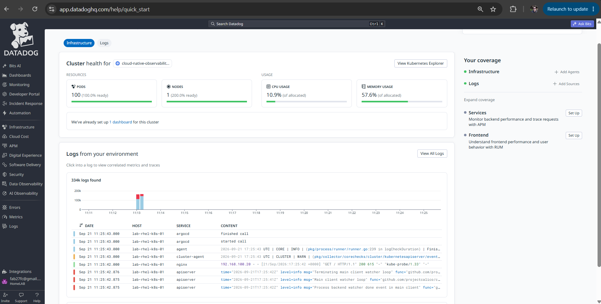
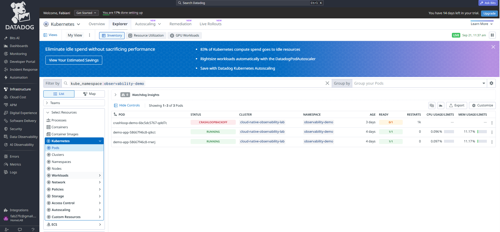
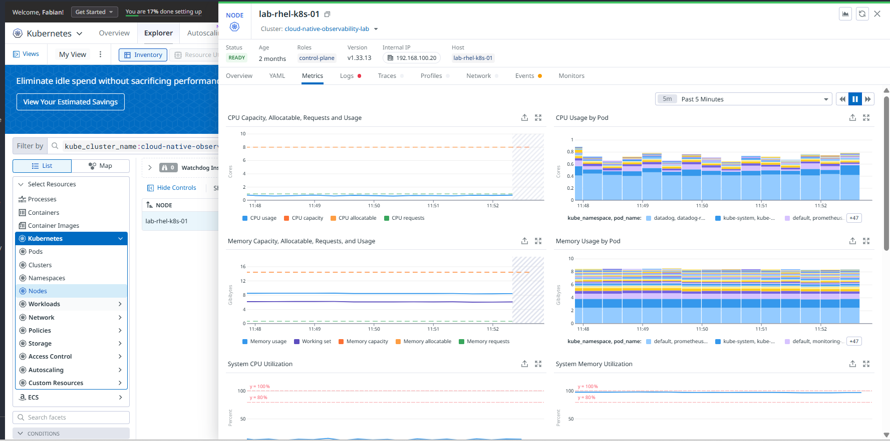
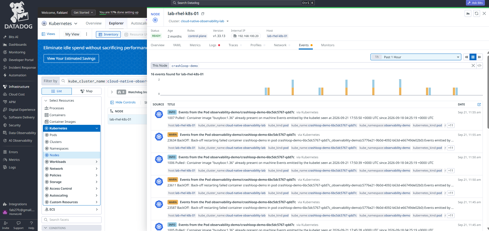
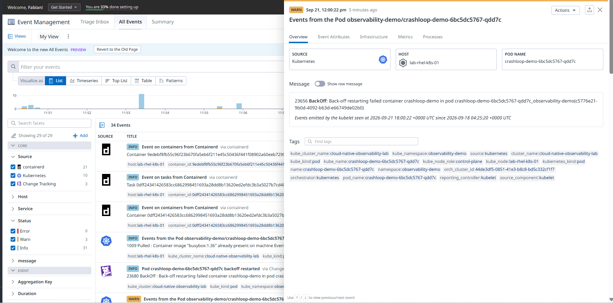

 # Datadog Integration

## Validation Status

Datadog is installed in the Kubernetes cluster through the official Helm chart
and is receiving telemetry from the cluster.

Verified configuration:

- Helm release: `datadog` in namespace `datadog`
- Chart: `datadog/datadog`
- Cluster name: `cloud-native-observability-lab`
- Node Agent: `3/3 Running`
- Cluster Agent: `1/1 Running`
- Logs collection: enabled
- Kubernetes events collection: enabled

## Datadog Cloud Validation

Open [Datadog Cloud](https://app.datadoghq.com) and navigate to the Kubernetes
cluster overview. The validated view shows:

- Cluster `cloud-native-observability-lab`
- Pods and nodes discovered
- CPU usage
- Memory usage
- Logs from the Kubernetes environment
- Kubernetes and application services visible in the log stream

This confirms that the Agent is authenticated and forwarding telemetry to
Datadog. The API key is stored in the Kubernetes Secret `datadog-secret` and is
not committed to this repository.

## Evidence

Save the Datadog cluster overview screenshot as:

File: `screenshots/datadog/11-datadog-cluster-overview.png`

The screenshot should include the cluster name, pod and node counts, CPU and
memory usage, and the log stream.

Additional Datadog evidence:

